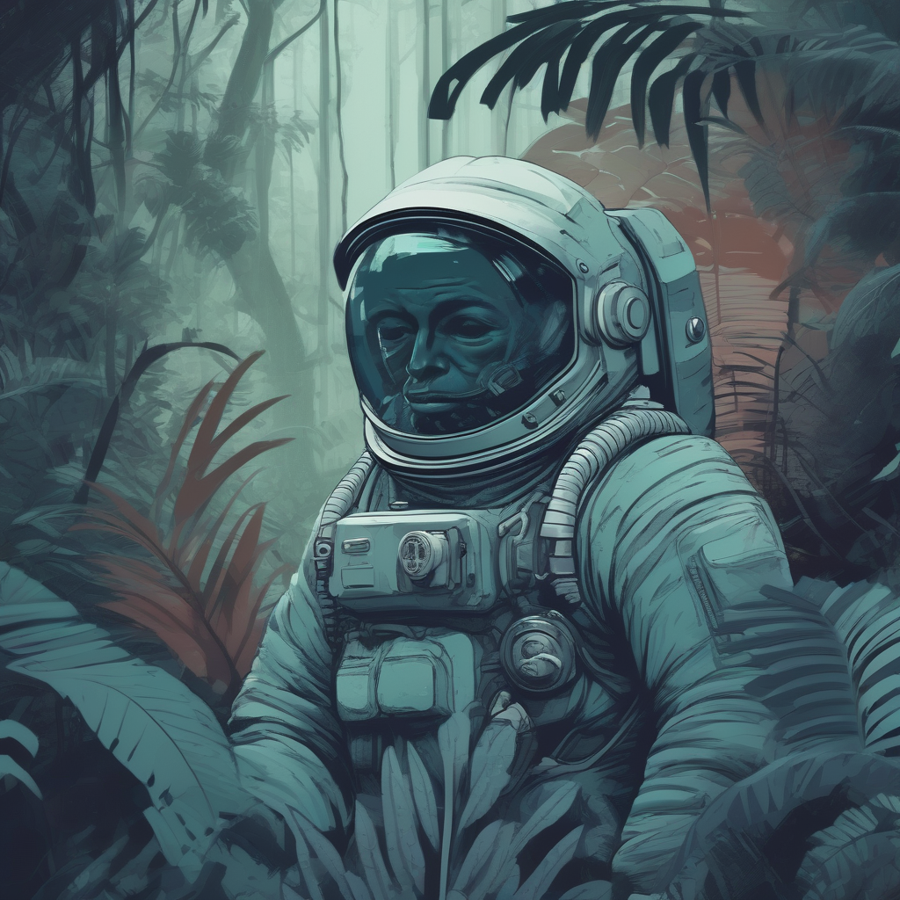

# 😊 Explorando IA Generativa com Python e Stable Diffusion XL

Este projeto faz parte dos meus primeiros passos com **Python, Jupyter Notebook e modelos de IA generativa**.  
Estou explorando como gerar imagens usando a biblioteca `diffusers` da Hugging Face e rodando tudo no **Google Colab**.

O código aqui foi adaptado com ajuda da comunidade e está funcionando (mesmo com os desafios de memória, tokens e configuração!). 💪

---

### ✨ Objetivo do projeto:
Gerar uma imagem com o prompt:  
> *"Astronaut in a jungle, cold color palette, muted colors, detailed, 8k"*

Usando modelos de IA como **Stable Diffusion XL**.

---

### 🛠️ Tecnologias usadas:
- Python
- Google Colab
- Hugging Face (`diffusers`, `transformers`)
- Stable Diffusion XL

---

### 🖼️ Resultado:

Aqui está a imagem que eu gerei e salvei:



> ✅ A imagem foi gerada com sucesso no Colab!
---

### 🧑‍💻 Como eu fiz (passo a passo):

1. Instalei as bibliotecas necessárias:
   ```python
   !pip install -U diffusers transformers accelerate safetensors

---
2. Carreguei o modelo e configurei para economizar memória:
    ```python
   pipe = StableDiffusionXLPipeline.from_pretrained(
    "stabilityai/stable-diffusion-xl-base-1.0",
    torch_dtype=torch.float16,
    use_safetensors=True,
    variant="fp16",
    low_cpu_mem_usage=True,
    )
---
3. Gerei a imagem com o prompt desejado:
    ```python
    image = pipe(
    prompt,
    height=1024,
    width=1024,
    guidance_scale=7.5,
    num_inference_steps=30,
    generator=torch.Generator("cuda" if torch.cuda.is_available() else "cpu").manual_seed(9)
    ).images[0]
    image.save("sd-xl.png")


